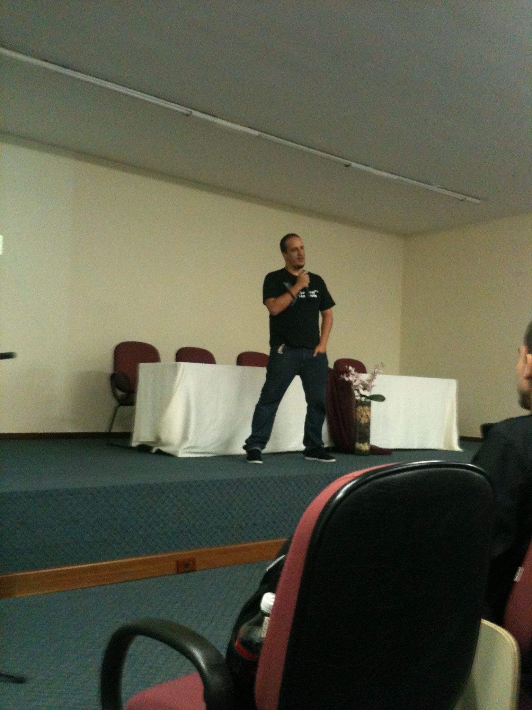
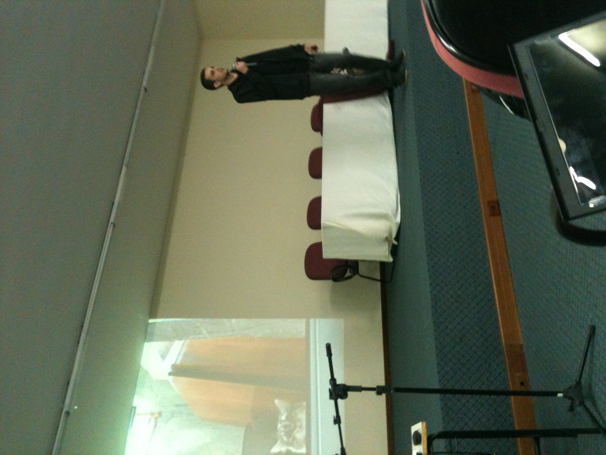
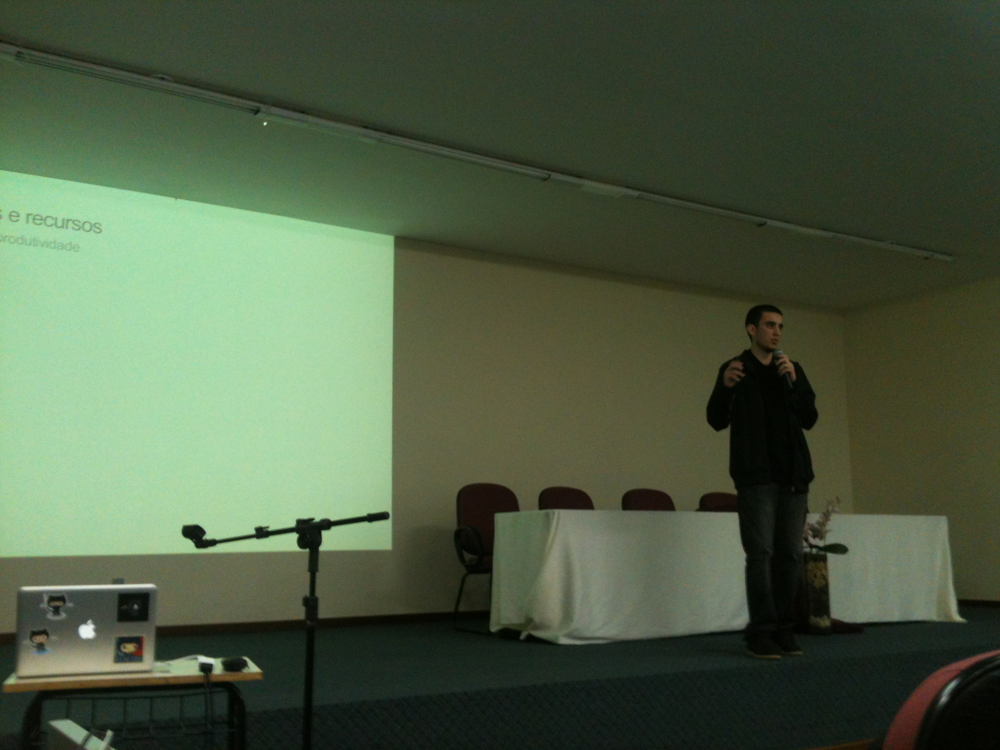
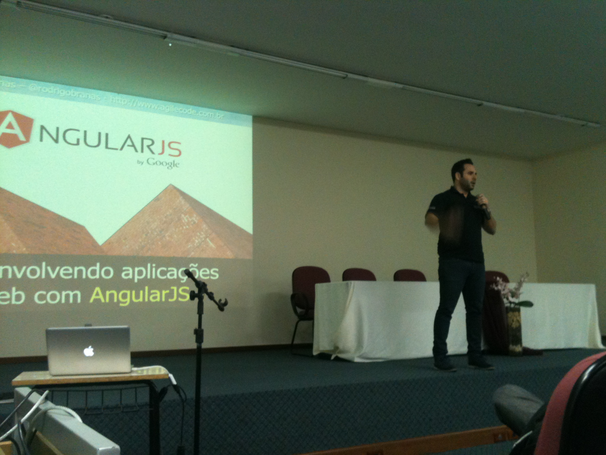
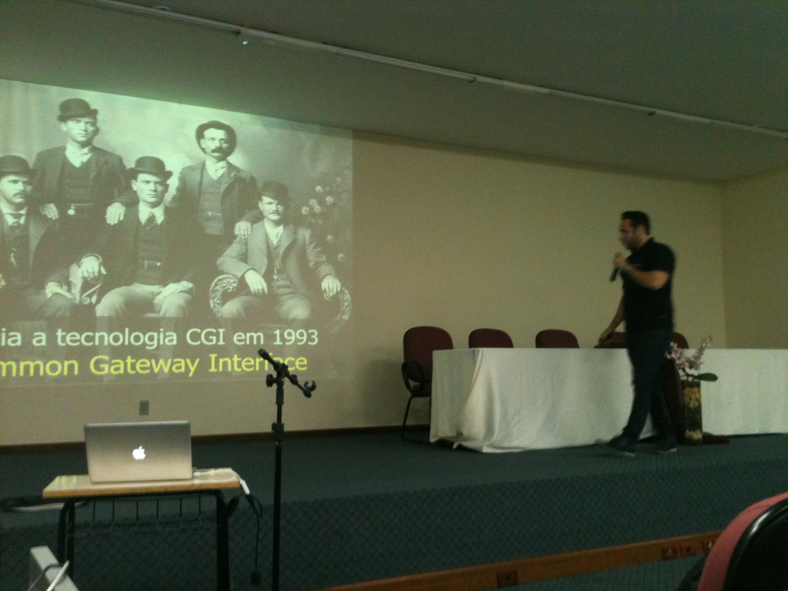
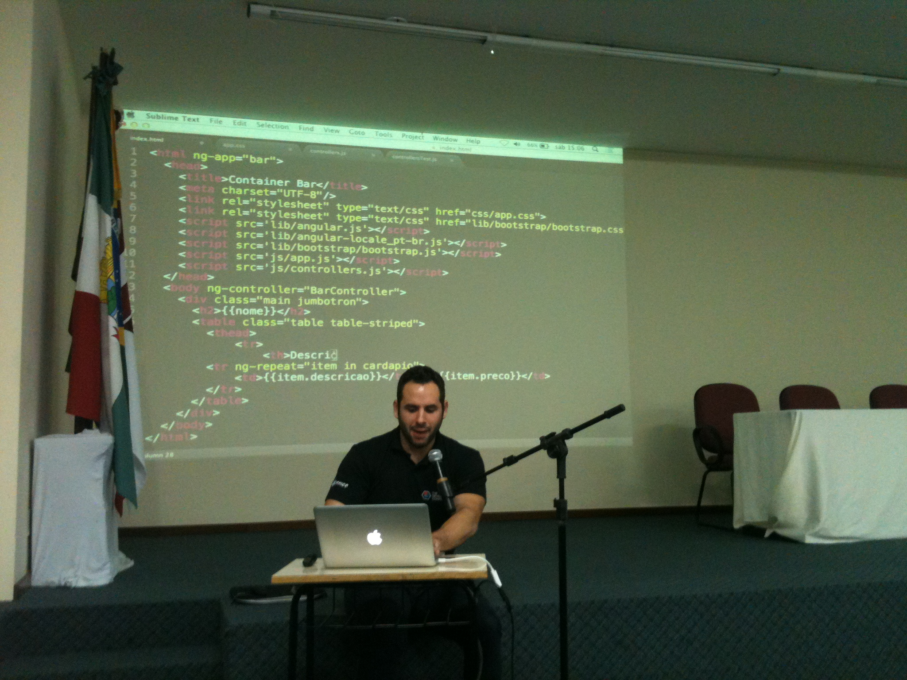
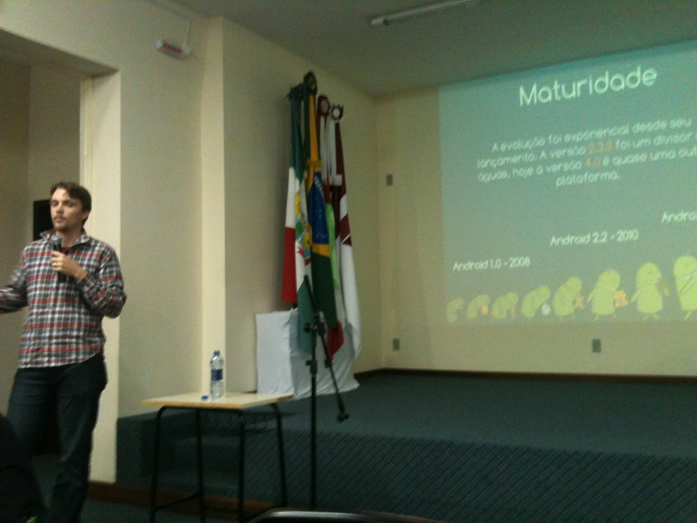

GDG Evento Inaugural
==========

13:45 - Alê Borba - O que são Grupos de Desenvolvedores Google?

14:30h - Lucas - Polymer

15:30h - Rodrigo Branas - AngularJS

16:15h - Guilherme - Overview and Get Start

17:00h - Alê Borba - Go for Baby Gophers